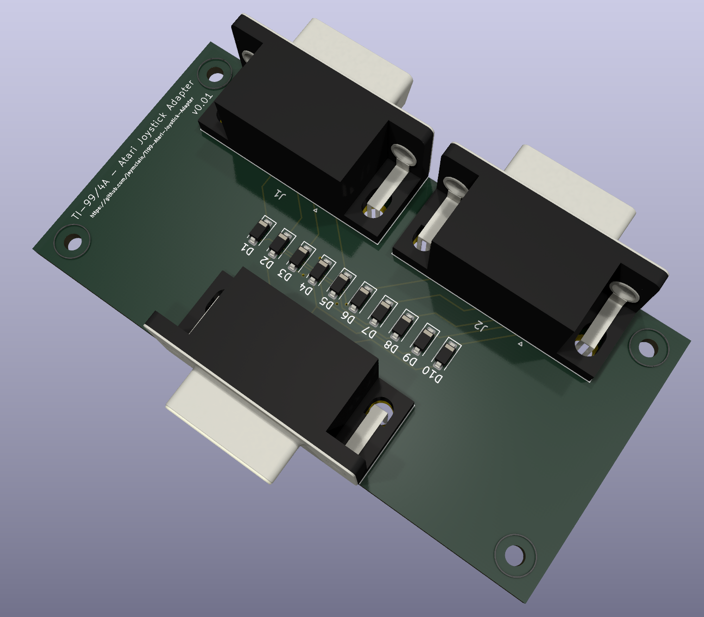

# Atari Joystick Adapter for the TI-99/4A

Based on the design from Gary Cook - Compute! magazine, August 1983 issue, and other internet resources.

v0.01

**NOTE: THIS PROJECT IS CURRENTLY UNTESTED!**

